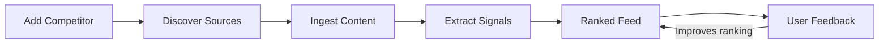
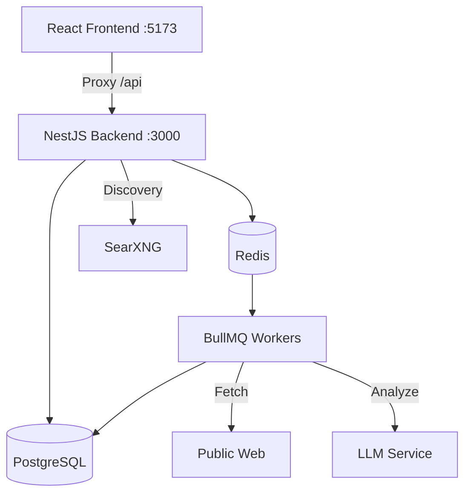

# Adaptive Competitor Intelligence System

A system that allows users to add any company as a competitor and receive continuously updated structured signals about meaningful public changes — pricing, hiring, product launches, and positioning shifts — derived from dynamically discovered sources on the internet.

## How It Works



**Five-layer pipeline:**

1. **Entity Layer** — Manage your company and competitors
2. **Source Discovery** — SearXNG-powered search finds pricing pages, blogs, job boards, news
3. **Ingestion** — Fetch HTML, strip boilerplate, store clean text
4. **Signal Extraction** — LLM (stubbed / Mistral-ready) detects pricing changes, feature launches, hiring spikes, positioning shifts
5. **Intelligence Feed** — Ranked by relevance (confidence + recency + user feedback), filterable by type and time

> See **[docs/architecture.md](docs/architecture.md)** for detailed diagrams covering the full system architecture, data pipeline, database schema, authentication flow, ranking algorithm, and background job architecture.

## Architecture

| Layer | Technology |
|-------|-----------|
| **Backend** | NestJS 11 + TypeScript + Prisma 7 |
| **Frontend** | React 19 + Vite 8 + Tailwind CSS 4 |
| **Database** | PostgreSQL 16 |
| **Queue** | Redis 7 + BullMQ |
| **Search** | SearXNG (self-hosted meta-search) |
| **LLM** | Stubbed (Mistral-ready interface) |



## Quick Start

### Prerequisites

- Node.js 20+
- Docker & Docker Compose

### 1. Start infrastructure

```bash
docker compose up -d
```

This starts PostgreSQL, Redis, and SearXNG.

### 2. Setup backend

```bash
cd backend
cp .env.example .env    # already configured for Docker defaults
npm install
npx prisma migrate dev  # run migrations
npm run start:dev
```

Backend runs on http://localhost:3000

### 3. Setup frontend

```bash
cd frontend
npm install
npm run dev
```

Frontend runs on http://localhost:5173 (proxies API calls to backend)

## API Endpoints

| Method | Path | Description |
|--------|------|-------------|
| POST | `/api/auth/register` | Register new user |
| POST | `/api/auth/login` | Login |
| GET | `/api/auth/profile` | Get current user |
| GET/POST | `/api/entities` | List/create entities |
| POST | `/api/entities/:id/competitors` | Add competitor |
| DELETE | `/api/entities/:id/competitors/:cid` | Remove competitor |
| PATCH | `/api/entities/:id/competitors/:cid/mute` | Mute/unmute |
| GET | `/api/sources?entityId=` | List sources |
| POST | `/api/sources/suggest` | Suggest a source |
| POST | `/api/sources/discover?entityId=` | Trigger source discovery |
| GET | `/api/signals` | List signals (filterable) |
| POST | `/api/signals/extract` | Extract signals from documents |
| GET | `/api/feed` | Intelligence feed (ranked) |
| GET | `/api/feed/daily-brief` | Daily brief grouped by type |
| POST | `/api/feedback` | Submit signal feedback |

## Testing

```bash
cd backend
npm test          # 46 unit tests
npm run test:e2e  # 31 integration tests (requires PostgreSQL + Redis)
```

The integration test covers the complete user flow end-to-end: register, login, create entity, add competitor, suggest source, ingest documents, extract signals, view feed, submit feedback, mute/unmute, and cascading deletes.

## Project Structure

```
├── docs/
│   └── architecture.md    # Detailed architecture with Mermaid diagrams
├── backend/
│   ├── src/
│   │   ├── auth/          # JWT authentication
│   │   ├── entities/      # Entity + competitor management
│   │   ├── sources/       # Source discovery (SearXNG)
│   │   ├── ingestion/     # HTML fetch + clean + store
│   │   ├── llm/           # LLM service (stubbed/Mistral)
│   │   ├── signals/       # Signal extraction
│   │   ├── feed/          # Intelligence feed + ranking
│   │   ├── feedback/      # Relevance feedback
│   │   ├── jobs/          # BullMQ processors
│   │   ├── prisma/        # Database service
│   │   └── common/        # Shared decorators/guards
│   ├── prisma/
│   │   └── schema.prisma  # Database schema
│   └── test/
│       └── full-flow.e2e-spec.ts  # Integration test
├── frontend/
│   └── src/
│       ├── api/           # API client
│       ├── components/    # Layout, SignalCard
│       ├── hooks/         # Auth context
│       └── pages/         # Dashboard, Entities, Feed, Signals, Login, Register
└── docker-compose.yml     # PostgreSQL + Redis + SearXNG
```

## Documentation

- **[Architecture & Diagrams](docs/architecture.md)** — System overview, data pipeline, ERD, authentication flow, ranking algorithm, background jobs, module dependencies, and complete request trace
