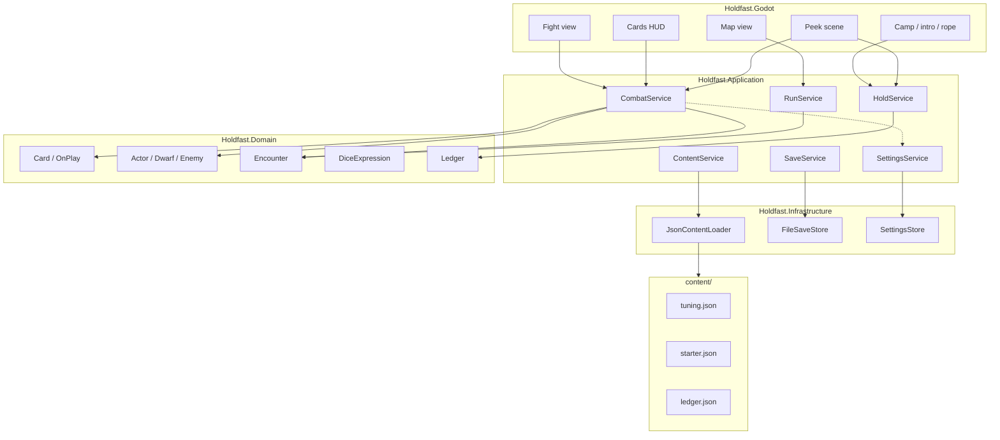
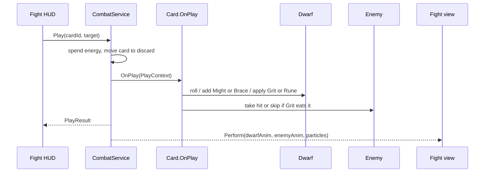
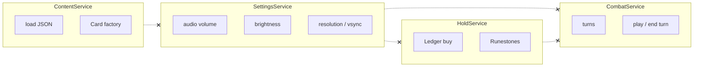

# Holdfast architecture

Godot 4 is the stage. C# domain is the game. JSON is the knobs.

Presentation (scenes, animation, input) talks to application services. Services talk to domain objects. Domain does not know Godot exists. A service that owns brightness does not know what a card is.

```
holdfast/
  src/
    Holdfast.Domain/           # pure C#, OOP game rules
    Holdfast.Application/      # services, use cases
    Holdfast.Infrastructure/   # JSON, disk save, OS settings
    Holdfast.Godot/            # scenes, views, particles, peek
  tests/
    Holdfast.Domain.Tests/
    Holdfast.Application.Tests/
    Holdfast.Architecture.Tests/
    Holdfast.Benchmarks/
  content/                     # already in repo; copied or linked at build
```

`Holdfast.Godot` references Application + Domain. Domain references nothing in this repo except itself.

## Layers



Dashed line on Settings: Combat may *read* a “screen shake” flag later. It still does not *own* volume or resolution.

## Play a card



`OnPlay` is rules. The view only performs what the result says.

## Ownership



Solid boxes are the only types that service may import from its own domain. Crosses are forbidden references (enforced in `quality/`).

Full type sketch: [domain.md](domain.md). Service list: [services.md](services.md). Solution and Godot boundary: [solution.md](solution.md).
