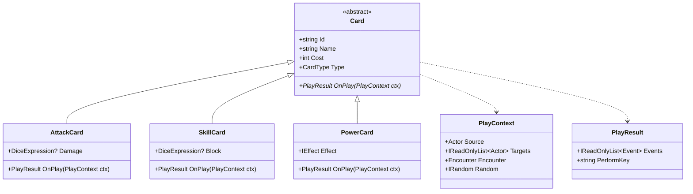
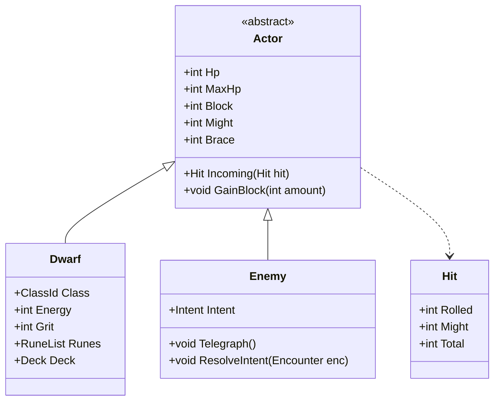

# Domain (OOP)

Pure C#. No `Godot` usings. No file paths. No volume sliders.

JSON becomes these objects via `ContentService` + a factory. The factory knows `type: "Attack"` → `AttackCard`. The card then owns what happens.

## Cards

`OnPlay` is the only place a card mutates the fight. No `switch (card.Id)` in CombatService.

Starters map like this (first guess, from `content/`):

| Id | Class | Kind |
| -- | ----- | ---- |
| Hew / Chip | `AttackCard` | roll damage, add source Might |
| Raise / Ward-cut | `SkillCard` | roll Block, add source Brace |
| Numb | `SkillCard` | `source.Grit += 2` (Warrior only; factory refuses on Runesmith) |
| Set Shoulder / Steady Hand | `SkillCard` | +Might or +Brace this fight |
| First Cut | `PowerCard` | Inscribe: next Attack adds `+1d4` |

New cards are a new subclass *or* a new `IEffect` plugged into `PowerCard` / `SkillCard`. Do not grow a god `Card` with 40 optional fields.

`PerformKey` is a string the view uses (`hew`, `raise`, `numb`). Domain does not play animations.

## Actors

`Actor.Incoming`:

1. `Hit.Total = rolled + attacker.Might`
2. If target is a `Dwarf` and `Total < Grit` → miss, Block untouched
3. Else apply Block + Brace, leftover to HP

Enemies do not have Grit. Runes live on `Dwarf` and only the Runesmith kit writes them.

## Combat and dice

- `DiceExpression` parses `1d6`, `1d4+2`, `2d4`. `null` = no roll.
- `Encounter` owns both sides, turn, discard, exhaust, who is telegraphing.
- `CombatService` starts encounters and calls `Card.OnPlay`. It does not implement Hew.

## Hold

`Ledger`, `LedgerNode`, `RunestonePurse`, `BrandTrack` are domain. Buying a node is `HoldService` applying a node effect to `HoldProgress`. Frame/Hearth/Spark stay as in the spec.
