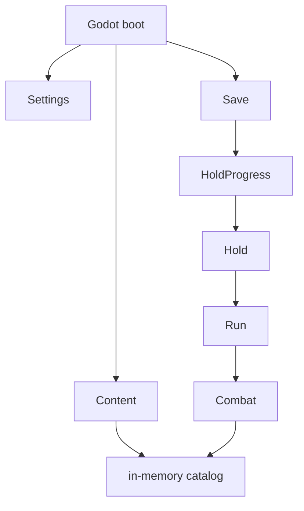

# Services

One owner per concern. If a service needs a foreign type, it is usually in the wrong place.

| Service | Owns | Must not know |
| ------- | ---- | ------------- |
| **SettingsService** | Master/SFX/music volume, brightness, resolution, fullscreen, vsync, language | `Card`, `Encounter`, `Ledger`, Runestones |
| **ContentService** | Load `content/*.json`, validate dice strings, build `Card` / `Enemy` / `Ledger` graphs via factories | How a fight resolves, current HP, volume |
| **SaveService** | Serialize `HoldProgress` + optional mid-run `RunState` to disk | How `OnPlay` works, Godot nodes, audio buses |
| **RunService** | This sortie: class, Brand, deck, gold, relics, map cursor, HP between fights | Settings, how to draw a card sprite |
| **CombatService** | One encounter: draw, energy, play, end turn, intents | File paths, JSON, resolution, Ledger prices |
| **HoldService** | Camp: spend Runestones, unlock nodes/classes, Brand clears | `OnPlay`, dice rolls, particle names |

Presentation helpers (Godot, not Application):

| Helper | Owns |
| ------ | ---- |
| **AudioPlayer** | Play a named sound. Reads volumes from SettingsService. |
| **Performer** | Idle / swing / flinch / haul from a `PlayResult.PerformKey`. |
| **PeekDirector** | Boots camp idle, a swing, a rope haul for agents. |

## Construction

Content loads once. Combat is created per fight and thrown away. Settings outlives everything.

## Tests as the wall

`Holdfast.Architecture.Tests` fails the build if:

- `Holdfast.Domain` references `GodotSharp` or `Holdfast.Godot`
- `SettingsService`’s assembly/namespace references `Holdfast.Domain.Cards` or `Combat`
- `Holdfast.Application` references `Holdfast.Godot`
- Godot views call `Card` constructors directly (they must go through ContentService / CombatService)

See [quality/README.md](../quality/README.md).
