# Architecture Documentation

## System Overview

The Adaptive Competitor Intelligence System is a five-layer pipeline that transforms raw public web content into actionable competitive signals. Users add competitors, the system automatically discovers and monitors sources, extracts structured signals, and delivers a ranked intelligence feed.

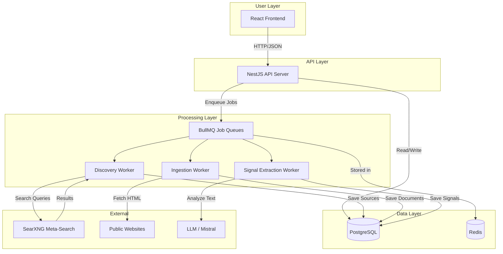

---

## Layer Architecture

The system is organized into five conceptual layers, each mapped to NestJS modules:

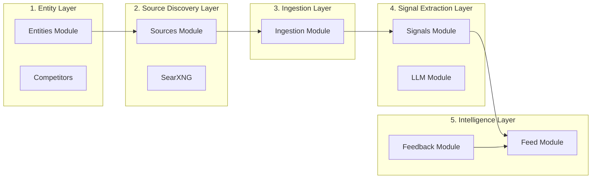

| Layer | Module | Responsibility |
|-------|--------|---------------|
| **Entity** | `entities/` | Manage companies and competitor relationships |
| **Source Discovery** | `sources/` | Find and validate web sources per entity |
| **Ingestion** | `ingestion/` | Fetch HTML, extract clean text, store documents |
| **Signal Extraction** | `signals/` + `llm/` | Analyze documents for meaningful changes |
| **Intelligence** | `feed/` + `feedback/` | Rank, filter, and deliver signals to users |

---

## Data Pipeline Flow

This is the core pipeline that transforms a competitor name into actionable intelligence:

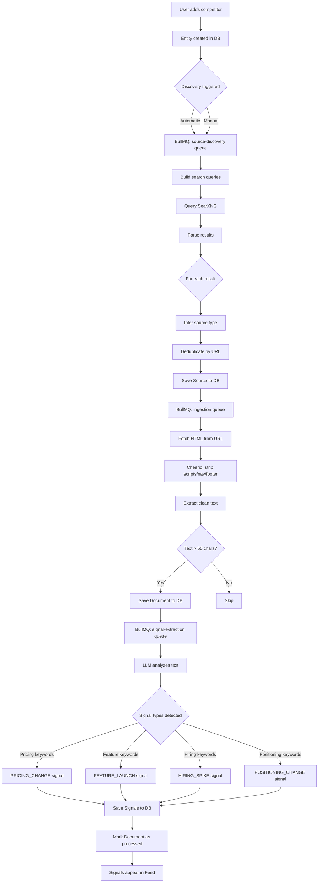

---

## Authentication Flow

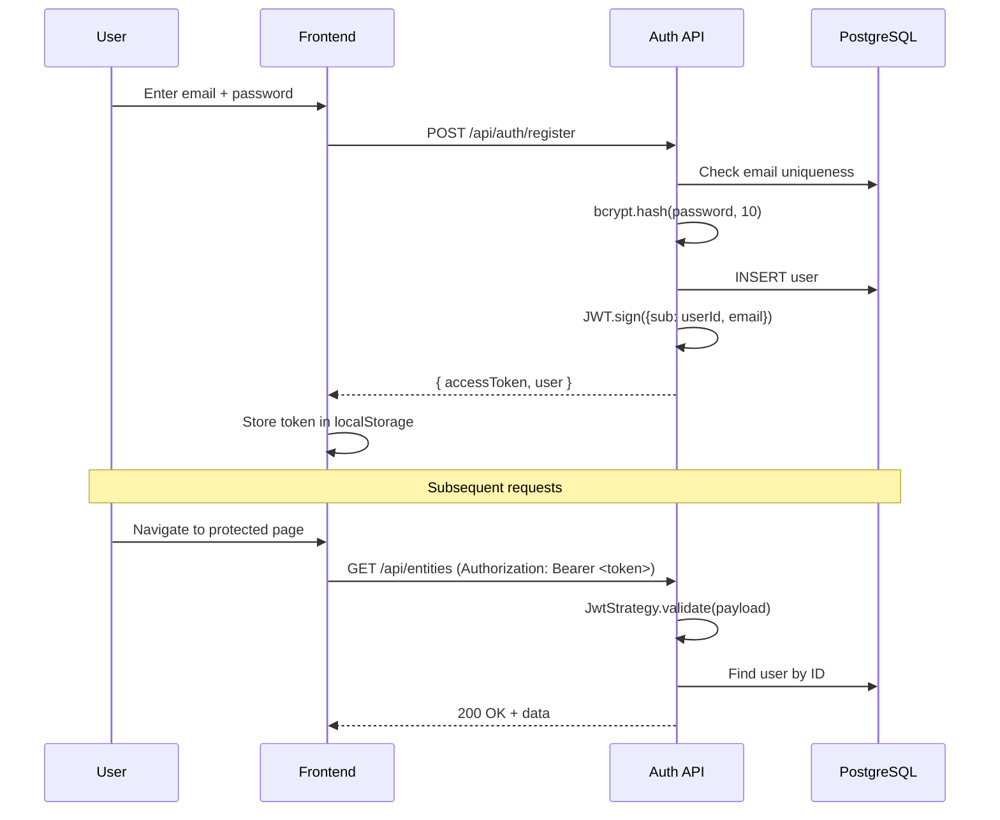

---

## Source Discovery Detail

The discovery system builds a per-entity source graph by generating targeted search queries and validating results.

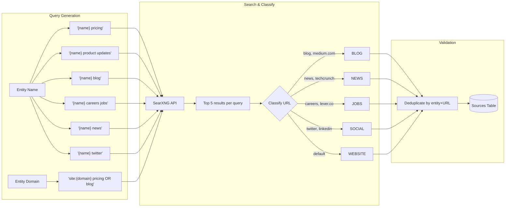

Source discovery can be triggered in three ways:
1. **Automatic** — BullMQ `source-discovery` queue processes entities on creation
2. **Manual API** — `POST /api/sources/discover?entityId=`
3. **User suggestion** — `POST /api/sources/suggest` with a specific URL

---

## Ingestion Pipeline Detail

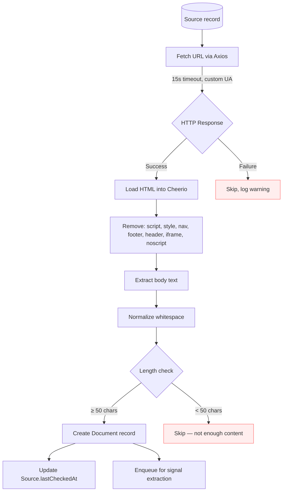

Key design decisions:
- **50-char minimum** prevents storing empty or boilerplate-only pages
- **50,000-char cap** prevents storing massive pages that would slow LLM processing
- **Non-content elements stripped** before text extraction for cleaner signal analysis
- **`lastCheckedAt` tracking** enables schedule-based re-ingestion

---

## Signal Extraction Detail

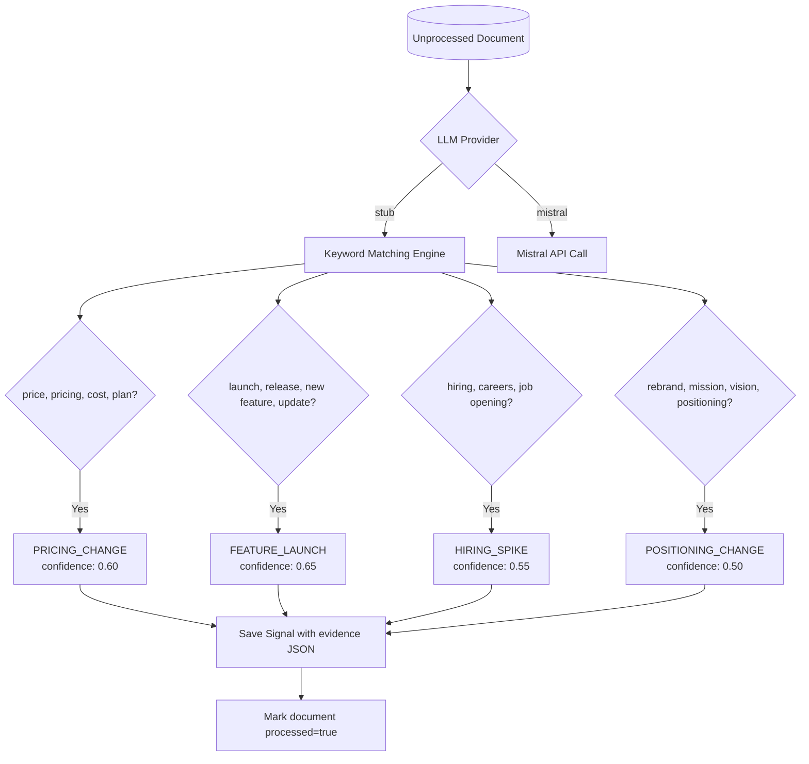

Each signal contains:
- **type** — One of the four signal categories
- **summary** — Human-readable description
- **confidence** — 0.0–1.0 score (stub uses fixed values; LLM will produce dynamic scores)
- **evidence** — JSON with matched keywords and a text snippet for auditability

---

## Feed Ranking Algorithm

The intelligence feed ranks signals by a composite relevance score:

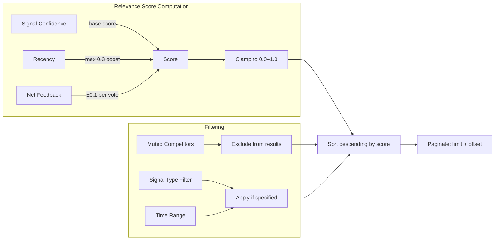

**Relevance formula:**

```
score = confidence
      + recencyBoost * 0.3      // recencyBoost = max(0, 1 - ageHours / 168)
      + (relevant - irrelevant) * 0.1

score = clamp(score, 0.0, 1.0)
```

- **Confidence** is the base signal quality score from the LLM
- **Recency** provides up to a 0.3 boost for signals detected in the last 7 days, linearly decaying to 0
- **Feedback** adjusts score by ±0.1 per net upvote/downvote from users

---

## Background Job Architecture

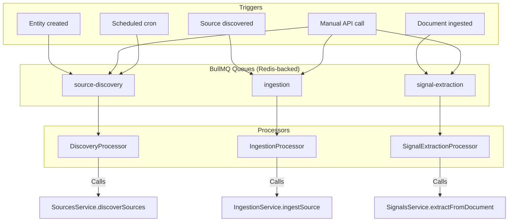

| Queue | Payload | Processor Logic |
|-------|---------|----------------|
| `source-discovery` | `{ entityId }` | Run search queries via SearXNG, save discovered sources |
| `ingestion` | `{ sourceId }` or `{ entityId }` | Fetch URL, clean HTML, store document |
| `signal-extraction` | `{ documentId }` or `{ entityId }` | Run LLM extraction, save signals, mark document processed |

---

## Database Schema (ERD)

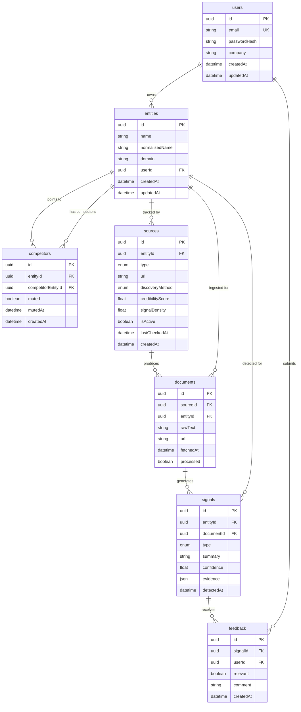

### Key Constraints

| Table | Unique Constraint | Purpose |
|-------|-------------------|---------|
| `users` | `email` | One account per email |
| `entities` | `(userId, normalizedName)` | No duplicate entities per user |
| `competitors` | `(entityId, competitorEntityId)` | No duplicate competitor links |
| `sources` | `(entityId, url)` | No duplicate source URLs per entity |
| `feedback` | `(signalId, userId)` | One feedback per user per signal (upsert) |

### Cascade Deletes

Deleting a **User** cascades to their entities. Deleting an **Entity** cascades to its sources, documents, signals, and competitor links. Deleting a **Signal** cascades to its feedback.

---

## User Journey

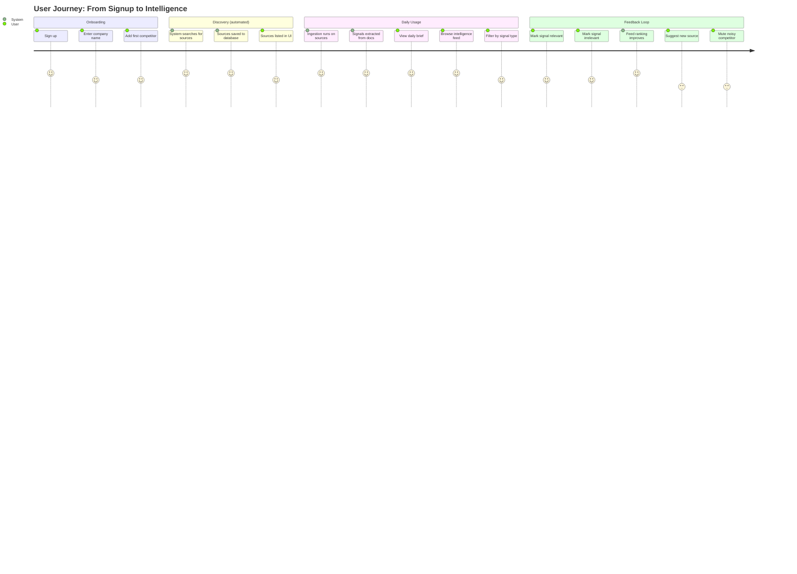

---

## Request Flow Example

Here's a complete trace of what happens when a user adds a competitor and eventually sees signals in their feed:

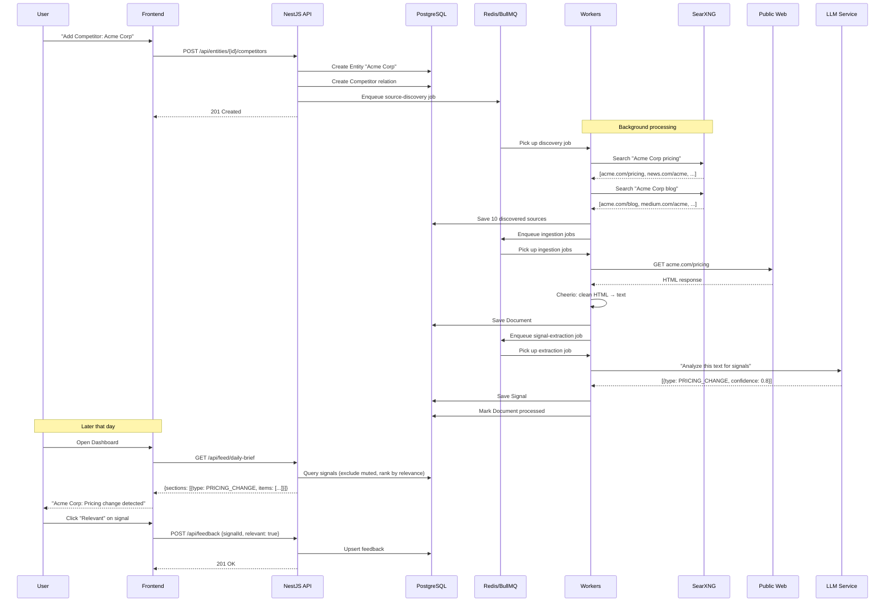

---

## Technology Stack

```mermaid
graph LR
    subgraph Frontend
        RE[React 19] --> VI[Vite 8]
        RE --> TW[Tailwind CSS 4]
        RE --> RR[React Router 7]
        RE --> AX1[Axios]
    end

    subgraph Backend
        NE[NestJS 11] --> PR[Prisma 7]
        NE --> PP[Passport JWT]
        NE --> BM[BullMQ 5]
        NE --> AX2[Axios]
        NE --> CH[Cheerio]
        PR --> PGA[@prisma/adapter-pg]
    end

    subgraph Infrastructure
        PG[(PostgreSQL 16)]
        RD[(Redis 7)]
        SX[SearXNG]
    end

    VI -->|Proxy /api| NE
    PGA --> PG
    BM --> RD
    NE -->|HTTP| SX
```

---

## Module Dependency Graph

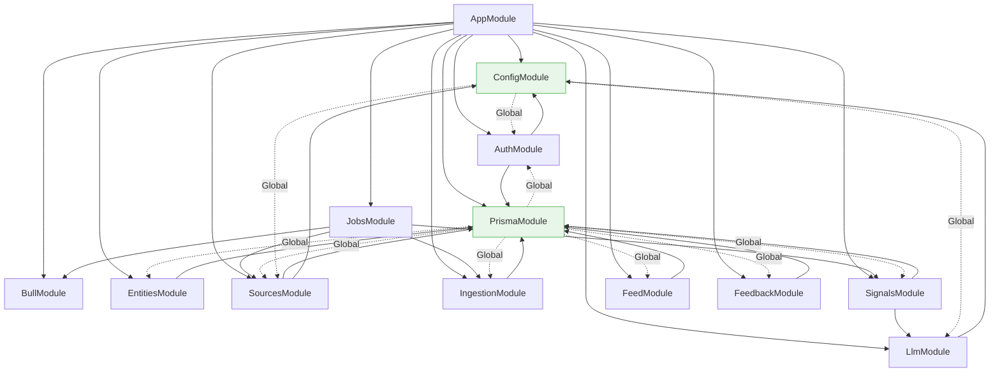

`PrismaModule` and `ConfigModule` are registered as global modules — all other modules can inject `PrismaService` and `ConfigService` without explicit imports.

---

## Observability

### Structured Logging (Pino)

All HTTP requests and application events are logged via [nestjs-pino](https://github.com/iamolegga/nestjs-pino) with structured JSON output.

**Development** (pretty-printed, colorized, single-line):

```
[18:47:08] INFO: request completed {"req":{"method":"POST","url":"/api/auth/login"},"res":{"statusCode":201},"responseTime":52}
```

**Production** (raw JSON for log aggregation):

```json
{"level":30,"time":1717264028000,"msg":"request completed","req":{"method":"POST","url":"/api/auth/login"},"res":{"statusCode":201},"responseTime":52}
```

Configuration via environment variables:

| Variable | Default | Description |
|----------|---------|-------------|
| `LOG_LEVEL` | `info` | Minimum log level: `trace`, `debug`, `info`, `warn`, `error`, `fatal` |
| `NODE_ENV` | `development` | Set to `production` for raw JSON output (no pretty-printing) |

Health check (`/health`) and Bull Board admin requests are excluded from request logging to reduce noise.

### Swagger API Documentation

Interactive API documentation is available at `/api/docs` when the server is running.

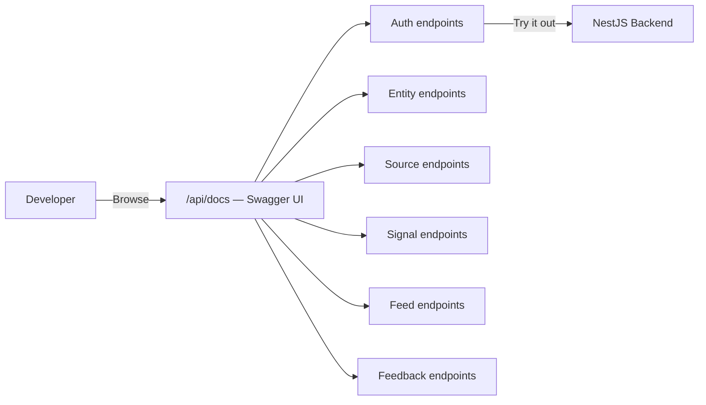

Features:
- **Try it out** — Execute API calls directly from the browser
- **Persistent authorization** — Enter a JWT token once and it persists across requests
- **Schema exploration** — View request/response schemas with examples for every DTO
- **Grouped by tags** — Auth, Entities, Sources, Signals, Feed, Feedback

### Bull Board (Queue Monitoring)

BullMQ job queues are monitored via [Bull Board](https://github.com/felixmosh/bull-board) at `/admin/queues`.

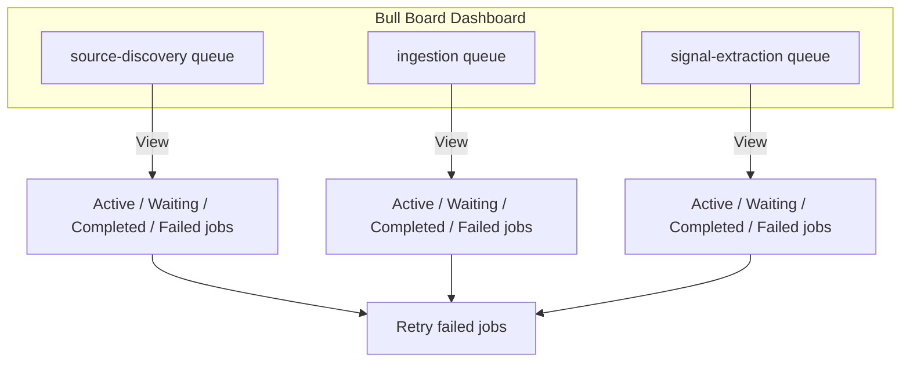

Capabilities:
- **Real-time view** of active, waiting, completed, and failed jobs per queue
- **Job details** — Inspect payload, return value, error stack traces
- **Retry/remove** — Manually retry failed jobs or clean completed ones
- **Progress tracking** — See job progress for long-running operations
